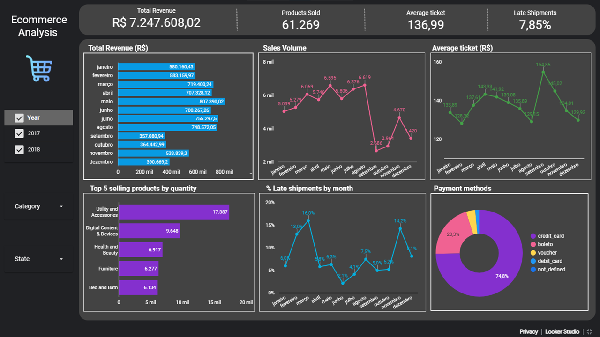

# Ecommerce Data Analysis

## Introduction

There are numerous details to keep track of when managing a profitable online store. From high-level indicators like revenue or the number of orders, down to more specific data like customer reviews. 

As many online retailers are learning, one possible solution is to create a dashboard specifically for your e-commerce site that contains metrics and other information you need to monitor on a regular basis. This dashboard will allow you to spot trends and other problems with your store that may need your attention.

When it comes to accessing data, dashboards can aid your e-commerce company by saving time and effort for everyone throughout the organization.

## Business Problem

In this project, you are a marketing analyst working for an online company, and you must assist the general manager in comprehending business performance.
The business is undergoing extreme growth. If necessary, they would rather sell more than they would make.

<h3>Objetives</h3> 

- Simplicity, higher-level and objective metrics that can generate a action plan;
- The business is interested in product and financial performance metrics;
- The corporation is also concerned about the logistics of the operation because delayed products lead to complaints;
- The company is also considering suspend payments by 'Brazilian Boleto System' and leave only card.

<h3>Questions to answer about store performance</h3>

- Total revenue
- Products sold
- Average ticket price
- Top 5 selling products
- Late shipments
- Payment methods

## Solution Strategy

<h3>Tools</h3>

- Google Sheets: to analyze the data 
- Looker Studio: to create the dashboard

<h3>Data Preprocessing</h3>

- The first step was to validate the dataset:
  - 6095 duplicate records were deleted;
  - 1244 records without category were allocated in the new category named "others" because I was unable to determine the appropriate category;
  - A new category column was created to to group several of them together to improve the analysis;
  - For the purpose of calculating shipment delays, a new column was created.
  
## Insights

* The period analyzed was from January 2017 to August 2018.
* The total revenue in 2017 was R$ 3.307.798,39, and until august 2018, it was R$ 3.939.809,63, showing an increase of 19.11%
* The year 2017 was marked by constant growth, with a monthly average of 22%. In comparison to October, November experienced a 46% growth, which can be justified by Christmas time.
* In 2018, the sales variation was much smaller, with the highest value in May with R$ 533.654,55 and the lowest value in February with R$ 445.620,14.
* In 2019, the average ticket was R$ 137.33, reaching the highest values in April and September, around R$ 154.
* In both years the top 5 categories remained the same, the largest being Utility and Accessories, followed by Digital Content & Devices, Health and Beauty, Bed and Beth and Furniture.
* The average percentage of late shipments increased from 6.34% to 9.12% in 2018. They reached their peak levels in February and March, with 15.8% and 20.3%, respectively.
* In terms of payment methods, credit cards account for 75% of transactions, while boleto (bank slips) account for 19% of all transactions.
* Take action to convert the majority of sales to credit cards.
* São Paulo had the highest concentration of sales during the examined time period, with approximately 38 percent. 

## Business Action Suggestion

* Conduct an investigation into the factors that lead to delivery delays and develop a strategy to address the issue.
* It is advised to concentrate marketing efforts in São Paulo state, due to the highest sales, showing the .

## Final Project

You can see the project <a href="https://datastudio.google.com/embed/reporting/76fc7645-d7d1-4cce-bcf0-63ceab12dded/page/p_5edvud7cwc" target="blank" rel="noopener noreferrer">here</a>

## Conclusion

The analysis's findings can be used by the general manager to maintain track of KPIs in one location, effectively communicate insights to c-level executives, and enable management to act quickly and decisively based on the most recent data.

