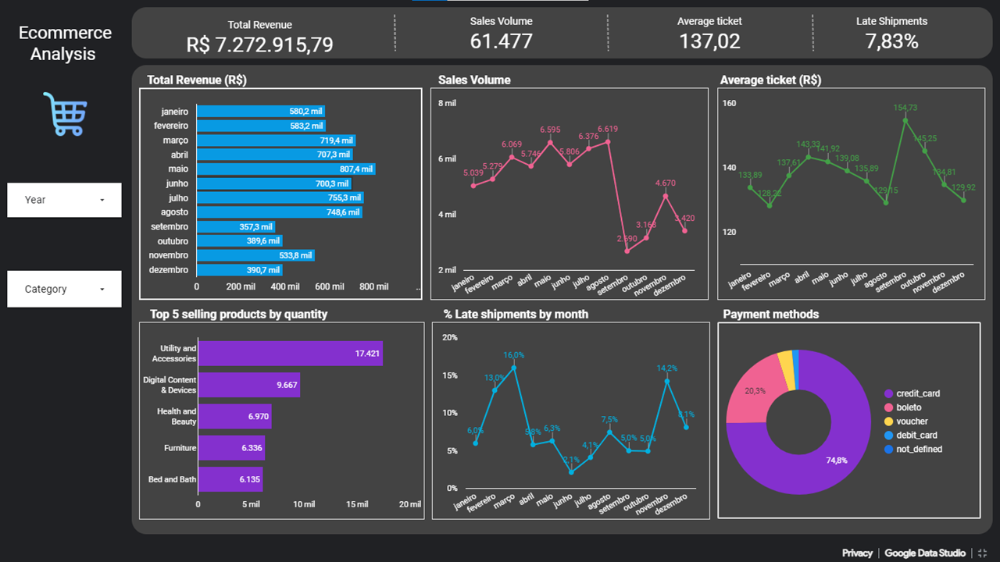

# Ecommerce Data Analysis

## Overview

There are numerous details to keep track of when managing a profitable online store. From high-level indicators like revenue or the number of orders, down to more specific data like customer reviews. 

As many online retailers are learning, one possible solution is to create a dashboard specifically for your e-commerce site that contains metrics and other information you need to monitor on a regular basis. This dashboard will allow you to spot trends and other problems with your store that may need your attention.

When it comes to accessing data, dashboards can aid your e-commerce company by saving time and effort for everyone throughout the organization.

## About the project

In this project, you are a marketing analyst working for an online company, and you must assist the general manager in comprehending business performance.
The business is undergoing extreme growth. If necessary, they would rather sell more than they would make.

**Objetives:** 
- Simplicity, higher-level and objective metrics that can generate a action plan;
- The business is interested in product and financial performance metrics;
- The corporation is also concerned about the logistics of the operation because delayed products lead to complaints;
- The company is also considering suspend payments by 'Brazilian Boleto System' and leave only card.

**Questions to answer about store performance:**
- Total revenue
- Products sold
- Average ticket price
- Top 5 selling products
- Late shipments
- Payment methods

**Tools:**

- Google Sheets: to analyze the data 
- Google Data Studio: to create the dashboard

**The process**

- The first step was to validate the dataset:
  - 6095 duplicate records were deleted;
  - 1244 records without category were allocated in the new category named "others" because I was unable to determine the appropriate category;
  - A new category column was created to to group several of them together to improve the analysis;
  - For the purpose of calculating shipment delays, a new column was created.

The analysis's findings can be used by the general manager to maintain track of KPIs in one location, effectively communicate insights to c-level executives, and enable management to act quickly and decisively based on the most recent data.

## Final Project

## Link to the project

You can see the project <a href="https://datastudio.google.com/embed/reporting/76fc7645-d7d1-4cce-bcf0-63ceab12dded/page/p_5edvud7cwc" target="blank" rel="noopener noreferrer">here</a>
